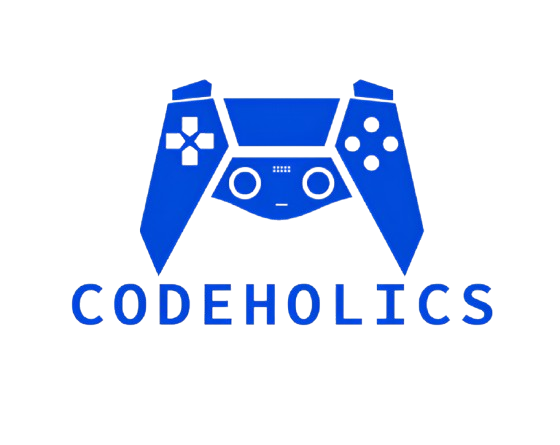

<h1 align="center"> Codeholics

 

## 🏢 Our team

<a href="https://github.com/MKLazarova23">Mila Lazarova</a> - Designer

<a href="https://github.com/alk09">Aleksandur Georgiev</a> - Scrum Trainer

<a href="https://github.com/BDKirov23">Borimir Kirov</a> - Back-end Developer

<a href="https://github.com/DSDimitrov23">Dimitur Dimitrov</a> - Back-end Developer

## 📋 Description of the game
### Our app aims to entertain and engage users with a puzzle game.

## 💻 Used technologies
- We used these apps for documentation:

   

- We used these apps to make and design our app:

  

     

- We used this app to communicate:

    
 

## 📃 Documentation 

###  Documentation

[Codeholics Documentation](https://github.com/alk09/Codeholics/blob/main/docs/Codeholics-documentation.docx)

### Presentation

[Codeholics Presentation](https://github.com/alk09/Codeholics/blob/main/docs/CODEHOLICS-presentation.pptx)

